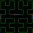

# CurveMoore3D

I wanted to make a color gradient that contained all colors. I remembered I saw somewhere a line that would fill a whole cube so I thought: if this cube is the [RGB color space](https://en.wikipedia.org/wiki/RGB_color_space), every point in this line would be a color and they would all be adjacent to each other.

I searched around and found what was in my memory: the [space‐filling Moore curve](https://en.wikipedia.org/wiki/Moore_curve). Good thing it's looping, so I can make a looping gradient.

I searched for an algorithm to build one of an order that would give the necessary amount of colors, but found nothing. So I went to study the theory behind it. Unfortunately, I imagined [rewrite systems](https://en.wikipedia.org/wiki/Rewriting) would take too long for me to learn, and I wanted to do this quickly, because there are higher priority things I want to do.

Reading further, the mention of a [hypercube](https://en.wikipedia.org/wiki/Hypercube) made me think I was way more advanced than I could handle. Only after finishing this I realized a 3D hypercube is just a cube… At least I'm well versed in [Gray code](https://en.wikipedia.org/wiki/Gray_code).

So I kept thinking about it during the following days. And things started to make sense. I understood how to use the Gray code, but I had no idea what those rotations where about. I looked into order 3 examples, compared it to order 2, and couldn't understand why the building blocks of order 3 were not equal to order 2.

Then I realized: those rotations must be transformations that are applied before building the next order, because otherwise there's no way to connect the copies. They must be math I'm not familiar with, because there's no way they can be made just with rotations.

So I set to brute force it. If I don't know how to make the "rotations", then I'll just transform them in whatever way that enables every copy to connect to its neighbors. Also, instead of transforming before generating the next order, I realized I needed to have a set of "rotations" to generate the current order and a different set of "rotations" to generate the next order, so I generate both for every order.

I don't know if the end result can be called a Moore curve, but it looks like it, works for any order, and loops. All this just to make this pretty picture:

I'd like to study this further to see if I can make the "rotations" a function of the Gray code.

## Explanation

I've implemented the 2D version now so now I can explain the reasoning behind the algorithm I implemented.

Consider the 2D curve in order 1 and 2:

- Order 1:

  

- Order 2:

  

Here I've painted the first point blue and the last point red. In order to build the next order, the curve in the previous order needs to be copied fourfold, translated each away from each other, and rotated accordingly.

However, for the order 3 curve, things start to get weird:

- Order 3:

  

Logic would say that an order 3 curve should be made out of 4 order 2 curves. However, if you divide an order 3 curve in 4 and compare to an order 2 curve you'll see that they look different.

However, you can also see that an order 3 curve is made out of 4 copies of the same shape, following the same rules as those used to build the order 2 curve. You can see the same behaviour in the higher orders.

This led me to the idea of, for every order, building 2 curves: one that is the curve for the current order and one that will be used to build the curve in the next order. The algorithm is the same regarding making 4 copies and translating them. The only thing that changes are the rotations. Also, for 2 of the 4 copies a mirror is also necessary together with the rotation.

So, to recap:

| Order | Current | Next |
| --- | --- | --- |
| 0 | A point at (0, 0) | A point at (0, 0) |
| 1 |  |  |
| 2 |  |  |
| 3 |  |  |

Also note that all "current" curves have first and last points close to each other, as they're supposed to be continuous. Likewise, all "next" curves have first and last points at the corners of their containing squares, as they're supposed to connect to the other copies.

Also also, the same algorithm is used for 3D. Only the rotations and mirrors are different. Probably the algorithm that generates the rotations and mirrors for any dimension are the same in the mathematical definition of a Moore curve. And I think there's a low chance I could achieve the same using Gray code, but I don't think I'll be pursuing that.
